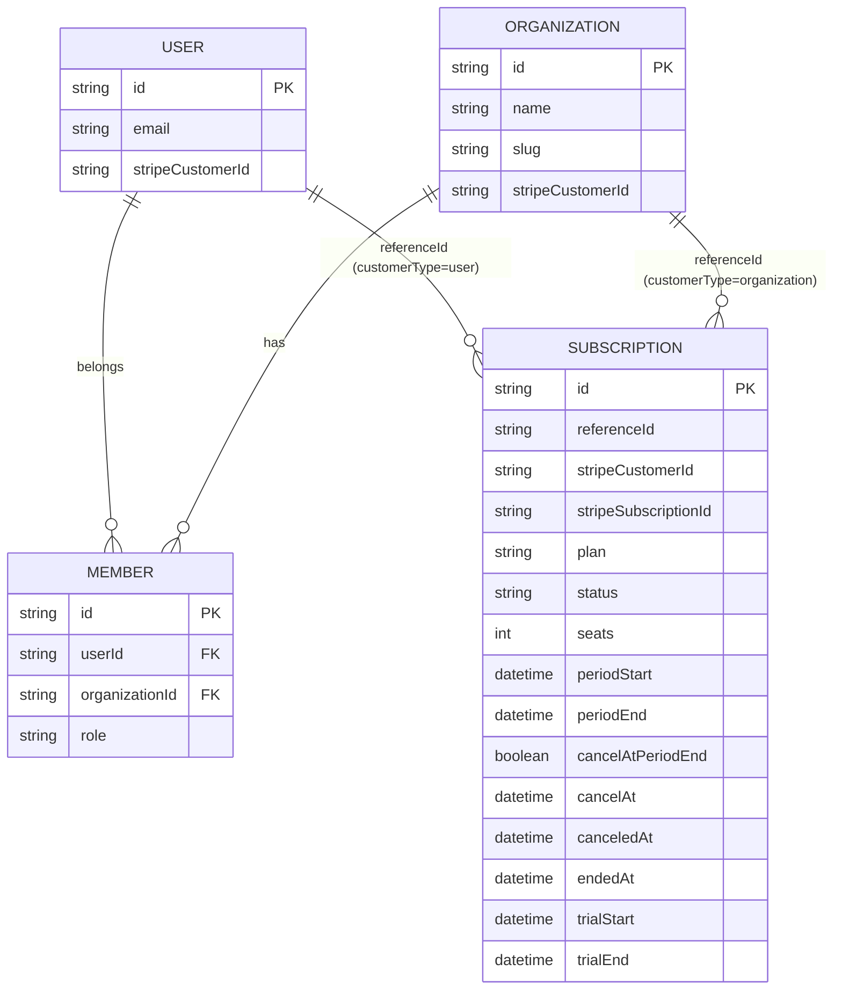

Better Auth の `organization` プラグインと `@better-auth/stripe` を組み合わせると、B2B SaaS でよくある「組織単位の課金」を比較的シンプルに実装できます。

この記事では、2026-03-02 時点の公式ドキュメントに基づいて、次を実装観点で整理します。

- どの設定が「組織課金」に必須か
- DB の関係（ER図）
- `upgrade / list / cancel / restore / billingPortal` の呼び出し形
- `authorizeReference` での権限制御
- Webhook と運用時の落とし穴

公式ドキュメント:

- https://www.better-auth.com/docs/plugins/organization
- https://www.better-auth.com/docs/plugins/stripe

## 全体像

まず前提は次の 3 点です。

1. Better Auth に `organization()` を入れる
2. Stripe プラグイン側で `organization.enabled: true` を有効化する
3. 課金API呼び出し時に `customerType: "organization"` と `referenceId: activeOrg.id` を渡す

ここが揃うと、課金主体が「ユーザー」から「組織」に切り替わります。

## ER図（組織課金）



補足:

- `subscription.referenceId` は「`user.id` または `organization.id`」を入れるポリモーフィック参照です
- `customerType: "organization"` を渡したときだけ `organization.id` を指します
- 権限制御は DB の外部キー制約よりも `authorizeReference` で担保する設計になります

## 実装引用 1: サーバー設定（auth.ts）

以下は公式例をベースに、組織課金向けにまとめた構成です。

```ts
import { betterAuth } from "better-auth";
import { organization } from "better-auth/plugins";
import { stripe } from "@better-auth/stripe";
import Stripe from "stripe";

const stripeClient = new Stripe(process.env.STRIPE_SECRET_KEY!, {
  apiVersion: "2025-11-17.clover",
});

export const auth = betterAuth({
  // database, trustedOrigins などは既存設定を利用
  plugins: [
    organization(),
    stripe({
      stripeClient,
      stripeWebhookSecret: process.env.STRIPE_WEBHOOK_SECRET!,
      createCustomerOnSignUp: true,
      organization: {
        enabled: true,
      },
      subscription: {
        enabled: true,
        plans: [
          {
            name: "team",
            priceId: process.env.STRIPE_PRICE_TEAM_MONTHLY!,
            annualDiscountPriceId: process.env.STRIPE_PRICE_TEAM_YEARLY!,
            limits: {
              members: 10,
              projects: 30,
            },
          },
          {
            name: "business",
            priceId: process.env.STRIPE_PRICE_BUSINESS_MONTHLY!,
            limits: {
              members: 50,
              projects: 200,
            },
            freeTrial: {
              days: 14,
            },
          },
        ],
        authorizeReference: async ({ user, referenceId, action }) => {
          const needsOrgPermission =
            action === "upgrade-subscription" ||
            action === "list-subscription" ||
            action === "cancel-subscription" ||
            action === "restore-subscription";

          if (!needsOrgPermission) return true;

          const member = await db.member.findFirst({
            where: {
              organizationId: referenceId,
              userId: user.id,
            },
          });

          return member?.role === "owner" || member?.role === "admin";
        },
      },
    }),
  ],
});
```

ポイント:

- `organization.enabled: true` を忘れると「組織 customer」として扱えません
- `authorizeReference` は必須に近い設定です（課金操作の主体を明示）
- `seats` を使う設計なら、プラン上限と組織メンバー上限の整合を別途管理します

## 実装引用 2: クライアント設定（auth-client.ts）

```ts
import { createAuthClient } from "better-auth/client";
import { organizationClient } from "better-auth/client/plugins";
import { stripeClient } from "@better-auth/stripe/client";

export const authClient = createAuthClient({
  plugins: [
    organizationClient(),
    stripeClient({
      subscription: true,
    }),
  ],
});
```

## 実装引用 3: 組織課金フロー

### 1. Checkout へ遷移（upgrade）

```ts
const { data: activeOrg } = authClient.useActiveOrganization();

await authClient.subscription.upgrade({
  plan: "team",
  referenceId: activeOrg!.id,
  customerType: "organization",
  seats: 10,
  successUrl: "/org/billing/success",
  cancelUrl: "/org/billing",
});
```

### 2. 有効サブスクを取得

```ts
const { data: subscriptions } = await authClient.subscription.list({
  query: {
    referenceId: activeOrg!.id,
    customerType: "organization",
  },
});
```

### 3. キャンセル / 復元 / Billing Portal

```ts
await authClient.subscription.cancel({
  referenceId: activeOrg!.id,
  customerType: "organization",
  subscriptionId: "sub_xxx",
  returnUrl: "/org/billing",
});

await authClient.subscription.restore({
  referenceId: activeOrg!.id,
  customerType: "organization",
  subscriptionId: "sub_xxx",
});

await authClient.subscription.billingPortal({
  referenceId: activeOrg!.id,
  customerType: "organization",
  returnUrl: "/org/billing",
});
```

## Webhook 設計

Stripe 側の Webhook 送信先は以下です（Better Auth デフォルトパス前提）。

`https://your-domain.com/api/auth/stripe/webhook`

最低限購読するイベント:

- `checkout.session.completed`
- `customer.subscription.created`
- `customer.subscription.updated`
- `customer.subscription.deleted`

実装上は、Better Auth 側が主要イベントを自動処理します。必要に応じて `onEvent` や `onSubscriptionUpdate` 等で業務処理を追加します。

## 運用で詰まりやすい点

### 1) 1 referenceId に同時アクティブ複数契約は持てない

`referenceId`（ユーザーまたは組織）単位で、同時に複数の active/trialing を持つ前提は非対応です。

### 2) 既存契約のプラン変更には `subscriptionId` が必要

未指定のまま `upgrade` を実行すると、二重課金に近い状態を作るリスクがあります。

### 3) Organization の請求メールは自動同期前提にしない

組織はユーザーと違って単一のメールを本質的に持たないため、請求先メールの運用ルールを別に設計します。

### 4) checkout 完了直後の画面遷移を「即反映」と決め打ちしない

最終状態は Webhook 反映で確定します。成功画面では「最終確定待ち」を許容する UI 設計が安全です。

## まとめ

Better Auth の organization + Stripe 構成は、`referenceId` と `customerType` の2つを軸に整理すると実装しやすくなります。

- モデル: `subscription.referenceId` が課金主体を表す
- 認可: `authorizeReference` で組織ロールを厳密にチェック
- 運用: Webhook 前提で整合性を確定する

最初は「owner/admin のみ課金操作可」「プラン数は最小」「Webhook 監視あり」で始めると、運用事故を抑えやすいです。

参考:

- https://www.better-auth.com/docs/plugins/organization
- https://www.better-auth.com/docs/plugins/stripe
