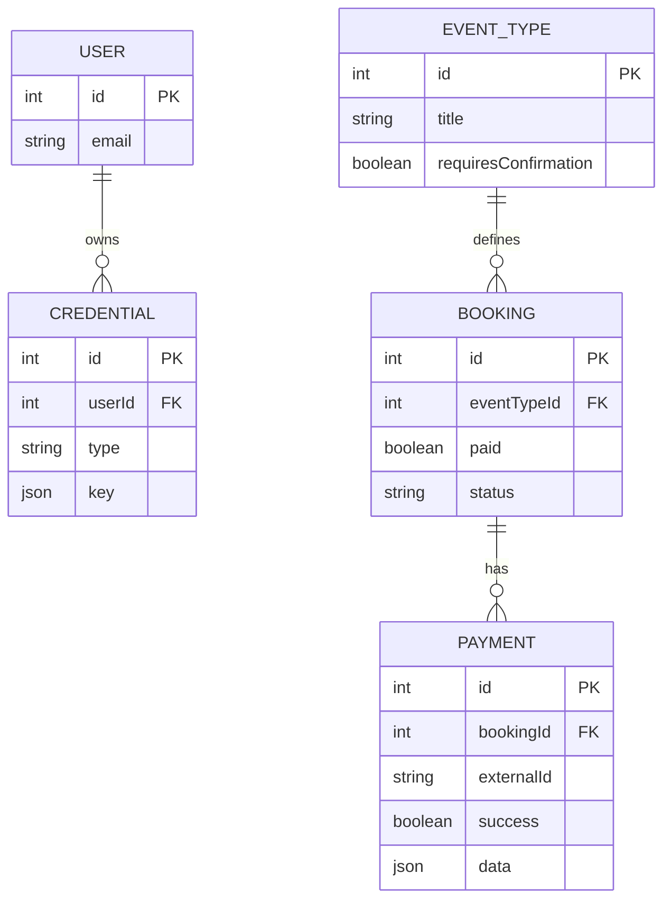
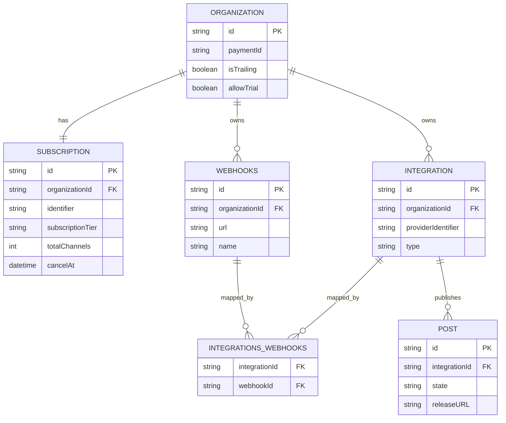

個人開発でStripe


## 結論（先に要点）

両者の実装を比較すると、SaaS の webhook 処理は次の5層に分解すると設計しやすくなります。

1. 受信境界（endpoint + raw body）
2. 検証境界（署名検証・改ざん防止）
3. 分配境界（event type ごとの handler）
4. 永続化境界（状態更新・冪等性）
5. 副作用境界（通知・ワークフロー・外部送信）

`cal.com` は「予約決済の状態遷移」を強く意識した構成、`postiz-app` は「課金イベント受信 + 投稿完了時の outbound webhook」を分離した構成が特徴です。

## 実装マップ

主要ファイルは次です。

- cal.com
  - [`packages/features/ee/payments/api/webhook.ts`](https://github.com/calcom/cal.com/blob/5d65a0f09199abeab9729d2665e9bed399692f55/packages/features/ee/payments/api/webhook.ts)
  - [`packages/app-store/_utils/payments/handlePaymentSuccess.ts`](https://github.com/calcom/cal.com/blob/5d65a0f09199abeab9729d2665e9bed399692f55/packages/app-store/_utils/payments/handlePaymentSuccess.ts)
  - [`apps/api/v2/src/modules/billing/controllers/billing.controller.ts`](https://github.com/calcom/cal.com/blob/5d65a0f09199abeab9729d2665e9bed399692f55/apps/api/v2/src/modules/billing/controllers/billing.controller.ts)
- postiz-app
  - [`apps/backend/src/api/routes/stripe.controller.ts`](https://github.com/gitroomhq/postiz-app/blob/main/apps/backend/src/api/routes/stripe.controller.ts)
  - [`libraries/nestjs-libraries/src/services/stripe.service.ts`](https://github.com/gitroomhq/postiz-app/blob/main/libraries/nestjs-libraries/src/services/stripe.service.ts)
  - [`apps/orchestrator/src/activities/post.activity.ts`](https://github.com/gitroomhq/postiz-app/blob/main/apps/orchestrator/src/activities/post.activity.ts)
  - [`apps/orchestrator/src/workflows/post-workflows/post.workflow.v1.0.1.ts`](https://github.com/gitroomhq/postiz-app/blob/main/apps/orchestrator/src/workflows/post-workflows/post.workflow.v1.0.1.ts)

以下のコードは、公開実装を読みやすくするために再構成した抜粋です（変数名や一部構造を簡略化）。

## 1. 各ステップの実装（cal.com）

### Step 1. 受信境界（endpoint）

```ts
// packages/features/ee/payments/api/webhook.ts
export default async function handler(req, res) {
  if (req.method !== "POST") return res.status(405).end();

  const signature = req.headers["stripe-signature"];
  if (!signature) return res.status(400).send("Missing stripe-signature");

  const payload = await buffer(req); // raw body
  // 次ステップで signature 検証
}
```

対応実装:

https://github.com/calcom/cal.com/blob/5d65a0f09199abeab9729d2665e9bed399692f55/packages/features/ee/payments/api/webhook.ts#L168-L188

### Step 2. 検証境界（署名検証）

```ts
const event = stripe.webhooks.constructEvent(
  payload,
  signature,
  process.env.STRIPE_WEBHOOK_SECRET
);
```

`constructEvent(...)` を通すことで、改ざんされた payload を早期に弾きます。

対応実装:

https://github.com/calcom/cal.com/blob/5d65a0f09199abeab9729d2665e9bed399692f55/packages/features/ee/payments/api/webhook.ts#L199-L208

### Step 3. 分配境界（event type dispatch）

```ts
const handlers = {
  "payment_intent.succeeded": handleStripePaymentSuccess,
  "setup_intent.succeeded": handleSetupSuccess
};

const fn = handlers[event.type];
if (!fn) {
  return res.status(202).json({ received: true, unhandled: event.type });
}

await fn(event, { stripe, prisma, req, res });
return res.status(200).json({ received: true });
```

未対応イベントを `202` で返し、Webhook 側の無限リトライを抑えるのがポイントです。

対応実装:

https://github.com/calcom/cal.com/blob/5d65a0f09199abeab9729d2665e9bed399692f55/packages/features/ee/payments/api/webhook.ts#L158-L161
https://github.com/calcom/cal.com/blob/5d65a0f09199abeab9729d2665e9bed399692f55/packages/features/ee/payments/api/webhook.ts#L226-L235

### Step 4. 永続化境界（Payment/Booking 更新）

```ts
async function handleStripePaymentSuccess(event, deps) {
  const paymentIntent = event.data.object;

  const payment = await deps.prisma.payment.findFirst({
    where: { externalId: paymentIntent.id },
    select: { id: true, bookingId: true }
  });

  if (!payment?.bookingId) return;

  await handlePaymentSuccess({
    paymentId: payment.id,
    bookingId: payment.bookingId,
    appSlug: "stripe"
  });
}
```

`externalId`（Stripe 側 ID）を内部 `Payment` に引き直して、`Booking` の状態遷移に接続します。

対応実装:

https://github.com/calcom/cal.com/blob/5d65a0f09199abeab9729d2665e9bed399692f55/packages/features/ee/payments/api/webhook.ts#L39-L63

### Step 5. 副作用境界（通知・workflow）

```ts
// packages/app-store/_utils/payments/handlePaymentSuccess.ts
await prisma.payment.update({
  where: { id: paymentId },
  data: { success: true }
});

await prisma.booking.update({
  where: { id: bookingId },
  data: { paid: true, status: "ACCEPTED" }
});

await triggerWebhook("BOOKING_PAID", bookingId);
await runWorkflows("BOOKING_PAID", bookingId);
```

決済成功を「フラグ更新」で終わらせず、予約ドメインの完了処理まで一貫して進める設計です。

対応実装:

https://github.com/calcom/cal.com/blob/5d65a0f09199abeab9729d2665e9bed399692f55/packages/app-store/_utils/payments/handlePaymentSuccess.ts#L102-L126
https://github.com/calcom/cal.com/blob/5d65a0f09199abeab9729d2665e9bed399692f55/packages/app-store/_utils/payments/handlePaymentSuccess.ts#L176-L204
https://github.com/calcom/cal.com/blob/5d65a0f09199abeab9729d2665e9bed399692f55/packages/app-store/_utils/payments/handlePaymentSuccess.ts#L205-L234

## 2. 各ステップの実装（postiz-app）

### Step 1. 受信境界（endpoint）

```ts
// apps/backend/src/api/routes/stripe.controller.ts
@Post("/stripe")
async stripe(@Req() req: RawBodyRequest<Request>) {
  const rawBody = req.rawBody;
  const signature = req.headers["stripe-signature"];
  // 次ステップで検証
}
```

対応実装:

https://github.com/gitroomhq/postiz-app/blob/main/apps/backend/src/api/routes/stripe.controller.ts#L12-L25

### Step 2. 検証境界（署名検証）

```ts
const event = this._stripeService.validateRequest(rawBody, signature);
```

`validateRequest(...)` で署名検証と event 復元を集中管理します。

対応実装:

https://github.com/gitroomhq/postiz-app/blob/main/apps/backend/src/api/routes/stripe.controller.ts#L20-L25
https://github.com/gitroomhq/postiz-app/blob/main/libraries/nestjs-libraries/src/services/stripe.service.ts#L25-L27

### Step 3. 分配境界（subscription event dispatch）

```ts
switch (event.type) {
  case "invoice.payment_succeeded":
    await this._stripeService.paymentSucceeded(event);
    break;
  case "customer.subscription.created":
    await this._stripeService.createSubscription(event);
    break;
  case "customer.subscription.updated":
    await this._stripeService.updateSubscription(event);
    break;
  case "customer.subscription.deleted":
    await this._stripeService.deleteSubscription(event);
    break;
  default:
    return { ok: true, unhandled: event.type };
}
```

対応実装:

https://github.com/gitroomhq/postiz-app/blob/main/apps/backend/src/api/routes/stripe.controller.ts#L38-L49

### Step 4. 永続化境界（Subscription/Organization 更新）

```ts
// libraries/.../subscription.repository.ts
await prisma.subscription.upsert({
  where: { organizationId },
  update: {
    subscriptionTier,
    totalChannels,
    period,
    cancelAt
  },
  create: {
    organizationId,
    identifier: stripeSubscriptionId,
    subscriptionTier,
    totalChannels,
    period
  }
});

await prisma.organization.update({
  where: { id: organizationId },
  data: { isTrailing: false, allowTrial: false }
});
```

Inbound webhook を受けて、課金状態を `Organization` の利用状態に反映させます。

対応実装:

https://github.com/gitroomhq/postiz-app/blob/main/libraries/nestjs-libraries/src/services/stripe.service.ts#L132-L156
https://github.com/gitroomhq/postiz-app/blob/main/libraries/nestjs-libraries/src/database/prisma/subscriptions/subscription.repository.ts#L130-L188

### Step 5. 副作用境界（Outbound webhook）

```ts
// apps/orchestrator/src/activities/post.activity.ts
async sendWebhooks(orgId: string, integrationId: string, postId: string) {
  const hooks = await this._webhookService.getWebhooks(orgId);
  const targets = hooks.filter((h) => h.integrations.some((i) => i.id === integrationId));
  const post = await this._postService.getPostByForWebhookId(postId);

  await Promise.all(
    targets.map((h) =>
      fetch(h.url, {
        method: "POST",
        headers: { "content-type": "application/json" },
        body: JSON.stringify(post)
      })
    )
  );
}
```

postiz-app は「Inbound（Stripe）と Outbound（投稿通知）を別経路で責務分離」している点が実装上の肝です。

対応実装:

https://github.com/gitroomhq/postiz-app/blob/main/apps/orchestrator/src/activities/post.activity.ts#L256-L282
https://github.com/gitroomhq/postiz-app/blob/main/apps/orchestrator/src/workflows/post-workflows/post.workflow.v1.0.1.ts#L240-L245

## 3. 関連テーブル ER 図

### 3.1 cal.com（予約決済 webhook）



### 3.2 postiz-app（subscription + outbound webhook）



## 4. 比較して見える実装パターン

| 観点 | cal.com | postiz-app |
| --- | --- | --- |
| 主対象 | 予約決済フローの整合 | 課金イベント + 投稿通知 |
| 受信口 | `/api/integrations/stripepayment/webhook` | `/stripe` |
| 検証 | Stripe署名検証 + raw body | Stripe署名検証 + raw body |
| 分配 | payment/setup intent中心 | subscription/invoice中心 |
| 副作用 | 予約状態遷移、通知、workflow | subscription更新、別経路で outbound webhook |

以下は実装読解に基づく推論です。  
両者とも「Webhook は最終状態そのものではなく、**内部状態遷移のトリガー**」として扱っています。  
このモデルを明示すると、再送・遅延・順不同イベントに対して設計しやすくなります。

## 5. 実務で使える設計テンプレート

最低限、次の構成にすると事故率を下げられます。

```ts
export async function handleWebhook(req: Request) {
  const rawBody = await req.text();
  const signature = req.headers.get("stripe-signature");
  if (!signature) return new Response("missing signature", { status: 400 });

  let event: Stripe.Event;
  try {
    event = stripe.webhooks.constructEvent(rawBody, signature, process.env.STRIPE_WEBHOOK_SECRET!);
  } catch {
    return new Response("invalid signature", { status: 400 });
  }

  // event.id で重複処理防止（idempotency）
  if (await alreadyProcessed(event.id)) return new Response("ok", { status: 200 });

  switch (event.type) {
    case "payment_intent.succeeded":
      await onPaymentSucceeded(event);
      break;
    default:
      // 未対応イベントは受信済みとして返す
      return new Response("unhandled", { status: 202 });
  }

  await markProcessed(event.id);
  return new Response("ok", { status: 200 });
}
```

## 6. 運用チェックリスト

- 署名検証は必ず raw body で行う（JSON parse 後の文字列では検証しない）
- event payload 全体を長期保存せず、`event.id` + 必要最小データだけ監査ログ化する
- idempotency キー（`event.id`）で再送を吸収する
- handler は DB 更新と副作用を分け、外部通知は queue/workflow で遅延実行する
- 未対応イベントの扱い（`202` か `200`）を明文化する
- プロバイダ側 retry 設定と自サービス側 dead letter の両方を用意する

## まとめ

`cal.com` と `postiz-app` は実装方針が異なるものの、Webhook を安全に運用するための本質は共通しています。

- 入口で厳格に検証
- event type ごとに責務分離
- 状態更新を中心に設計
- 副作用は非同期化

Stripe webhook を使う SaaS を実装するなら、まずこの4点を土台にし、その上で
ドメイン固有の状態遷移（予約、サブスク、通知）を積み上げるのが実務的です。

## 参考リンク

https://github.com/calcom/cal.com
https://github.com/gitroomhq/postiz-app
