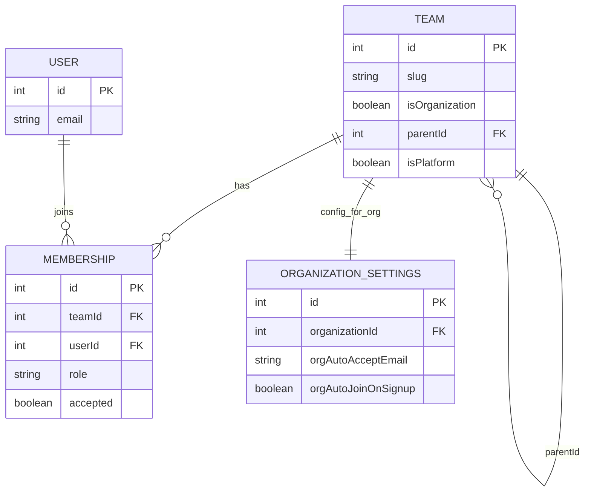

この記事は、`calcom/cal.com` の Organization 機能を実装ベースで追った技術メモです。

調査対象コミット（2026-02-25時点）:
`5d65a0f09199abeab9729d2665e9bed399692f55`

## 結論（先に要点）

cal.com の Organization は、次の構成で実装されています。

1. 組織もチームも `Team` テーブルで表現し、`isOrganization` と `parentId` で意味を分ける
2. 組織作成は `viewer.organizations.create` から入り、`OrganizationRepository` が `Team + OrganizationSettings + OWNER Membership` を作る
3. 権限は PBAC (`organization.*`, `team.*`) と fallback role (`OWNER/ADMIN/MEMBER`) の組み合わせで判定
4. メンバー管理・サブチーム管理・SSO・自動参加・サブドメイン解決まで、Organization 前提のロジックが各層に展開されている

## 実装マップ

Organization 機能の主要ファイルは次です。

- データモデル
  - [`packages/prisma/schema.prisma`](https://github.com/calcom/cal.com/blob/5d65a0f09199abeab9729d2665e9bed399692f55/packages/prisma/schema.prisma)
- tRPC（Webアプリ側）
  - [`packages/trpc/server/routers/viewer/organizations/_router.tsx`](https://github.com/calcom/cal.com/blob/5d65a0f09199abeab9729d2665e9bed399692f55/packages/trpc/server/routers/viewer/organizations/_router.tsx)
  - [`packages/trpc/server/routers/viewer/organizations/create.handler.ts`](https://github.com/calcom/cal.com/blob/5d65a0f09199abeab9729d2665e9bed399692f55/packages/trpc/server/routers/viewer/organizations/create.handler.ts)
  - [`packages/trpc/server/routers/viewer/organizations/list.handler.ts`](https://github.com/calcom/cal.com/blob/5d65a0f09199abeab9729d2665e9bed399692f55/packages/trpc/server/routers/viewer/organizations/list.handler.ts)
  - [`packages/trpc/server/routers/viewer/organizations/createTeams.handler.ts`](https://github.com/calcom/cal.com/blob/5d65a0f09199abeab9729d2665e9bed399692f55/packages/trpc/server/routers/viewer/organizations/createTeams.handler.ts)
  - [`packages/trpc/server/routers/viewer/organizations/deleteTeam.handler.ts`](https://github.com/calcom/cal.com/blob/5d65a0f09199abeab9729d2665e9bed399692f55/packages/trpc/server/routers/viewer/organizations/deleteTeam.handler.ts)
  - [`packages/trpc/server/routers/viewer/organizations/getMembers.handler.ts`](https://github.com/calcom/cal.com/blob/5d65a0f09199abeab9729d2665e9bed399692f55/packages/trpc/server/routers/viewer/organizations/getMembers.handler.ts)
  - [`packages/trpc/server/routers/viewer/organizations/listMembers.handler.ts`](https://github.com/calcom/cal.com/blob/5d65a0f09199abeab9729d2665e9bed399692f55/packages/trpc/server/routers/viewer/organizations/listMembers.handler.ts)
  - [`packages/trpc/server/routers/viewer/organizations/update.handler.ts`](https://github.com/calcom/cal.com/blob/5d65a0f09199abeab9729d2665e9bed399692f55/packages/trpc/server/routers/viewer/organizations/update.handler.ts)
- Organization リポジトリ
  - [`packages/features/ee/organizations/repositories/OrganizationRepository.ts`](https://github.com/calcom/cal.com/blob/5d65a0f09199abeab9729d2665e9bed399692f55/packages/features/ee/organizations/repositories/OrganizationRepository.ts)
- 権限
  - [`packages/features/pbac/domain/types/permission-registry.ts`](https://github.com/calcom/cal.com/blob/5d65a0f09199abeab9729d2665e9bed399692f55/packages/features/pbac/domain/types/permission-registry.ts)
  - [`apps/web/modules/members/getOrgMembersPageData.ts`](https://github.com/calcom/cal.com/blob/5d65a0f09199abeab9729d2665e9bed399692f55/apps/web/modules/members/getOrgMembersPageData.ts)
- UIルーティング
  - [`apps/web/app/(use-page-wrapper)/settings/(settings-layout)/SettingsLayoutAppDirClient.tsx`](https://github.com/calcom/cal.com/blob/5d65a0f09199abeab9729d2665e9bed399692f55/apps/web/app/%28use-page-wrapper%29/settings/%28settings-layout%29/SettingsLayoutAppDirClient.tsx)
- API v2（Platform/管理系）
  - [`apps/api/v2/src/modules/organizations/teams/index/organizations-teams.controller.ts`](https://github.com/calcom/cal.com/blob/5d65a0f09199abeab9729d2665e9bed399692f55/apps/api/v2/src/modules/organizations/teams/index/organizations-teams.controller.ts)
  - [`apps/api/v2/src/modules/organizations/organizations/organizations-organizations.controller.ts`](https://github.com/calcom/cal.com/blob/5d65a0f09199abeab9729d2665e9bed399692f55/apps/api/v2/src/modules/organizations/organizations/organizations-organizations.controller.ts)
- SSO / 自動参加
  - [`packages/features/auth/lib/next-auth-options.ts`](https://github.com/calcom/cal.com/blob/5d65a0f09199abeab9729d2665e9bed399692f55/packages/features/auth/lib/next-auth-options.ts)
  - [`packages/features/ee/sso/lib/sso.ts`](https://github.com/calcom/cal.com/blob/5d65a0f09199abeab9729d2665e9bed399692f55/packages/features/ee/sso/lib/sso.ts)
  - [`apps/web/modules/ee/organizations/components/OrgAutoJoinSetting.tsx`](https://github.com/calcom/cal.com/blob/5d65a0f09199abeab9729d2665e9bed399692f55/apps/web/modules/ee/organizations/components/OrgAutoJoinSetting.tsx)
- ドメイン運用
  - [`packages/features/ee/organizations/lib/orgDomains.ts`](https://github.com/calcom/cal.com/blob/5d65a0f09199abeab9729d2665e9bed399692f55/packages/features/ee/organizations/lib/orgDomains.ts)
  - [`packages/lib/domainManager/organization.ts`](https://github.com/calcom/cal.com/blob/5d65a0f09199abeab9729d2665e9bed399692f55/packages/lib/domainManager/organization.ts)

## 1. データモデル: Teamテーブルを二役で使う

`Team` は「通常チーム」と「組織」の両方を表現します。

- `isOrganization=true` で組織
- `parentId` がある `Team` は組織配下のサブチーム
- `Membership` が `OWNER/ADMIN/MEMBER` を持ち、組織とチーム双方の所属を担う
- `OrganizationSettings` に `orgAutoAcceptEmail` や `orgAutoJoinOnSignup` など組織固有設定を持つ

ER 図で見ると、モデル関係は次のようになります（実装意図の把握用に主要カラムのみ記載）。

この設計により、同一の membership/pbac 基盤を使って、組織とチームを一貫管理できます。

対応実装:

https://github.com/calcom/cal.com/blob/5d65a0f09199abeab9729d2665e9bed399692f55/packages/prisma/schema.prisma#L569-L666

https://github.com/calcom/cal.com/blob/5d65a0f09199abeab9729d2665e9bed399692f55/packages/prisma/schema.prisma#L720-L782

## 2. 組織作成フロー（tRPC → Repository）

### 2.1 エントリポイント

Web 側は `viewer.organizations.create` から組織作成を呼びます。

対応実装:

https://github.com/calcom/cal.com/blob/5d65a0f09199abeab9729d2665e9bed399692f55/packages/trpc/server/routers/viewer/organizations/_router.tsx#L42-L51

### 2.2 create.handler の責務

[`create.handler.ts`](https://github.com/calcom/cal.com/blob/5d65a0f09199abeab9729d2665e9bed399692f55/packages/trpc/server/routers/viewer/organizations/create.handler.ts) では、実質的に以下を行います。

- self-serve可否 (`ORG_SELF_SERVE_ENABLED`) や owner email 条件の検証
- 既存 slug / reserved subdomain の衝突チェック
- `createDomain(slug)` によるドメイン設定トライ
- owner の存在有無で `createWithExistingUserAsOwner` / `createWithNonExistentOwner` に分岐

対応実装:

https://github.com/calcom/cal.com/blob/5d65a0f09199abeab9729d2665e9bed399692f55/packages/trpc/server/routers/viewer/organizations/create.handler.ts#L49-L173

https://github.com/calcom/cal.com/blob/5d65a0f09199abeab9729d2665e9bed399692f55/packages/trpc/server/routers/viewer/organizations/create.handler.ts#L194-L297

### 2.3 永続化の実体

`OrganizationRepository` 側で、実際に以下を作成します。

- `Team(isOrganization=true)`
- `OrganizationSettings`（`orgAutoAcceptEmail` など）
- owner の `Membership(role=OWNER, accepted=true)`
- 必要に応じて owner 用 `Profile` / `User`

対応実装:

https://github.com/calcom/cal.com/blob/5d65a0f09199abeab9729d2665e9bed399692f55/packages/features/ee/organizations/repositories/OrganizationRepository.ts#L28-L131

https://github.com/calcom/cal.com/blob/5d65a0f09199abeab9729d2665e9bed399692f55/packages/features/ee/organizations/repositories/OrganizationRepository.ts#L133-L182

## 3. Organizationコンテキストと設定画面

`viewer.organizations.listCurrent` は、ユーザーの現在組織を読み出し、設定画面の基礎データになります。

UI では Settings の `organization` タブに、`profile/general/members/privacy/SSO/dsync` が並びます。

対応実装:

https://github.com/calcom/cal.com/blob/5d65a0f09199abeab9729d2665e9bed399692f55/packages/trpc/server/routers/viewer/organizations/list.handler.ts#L15-L43

https://github.com/calcom/cal.com/blob/5d65a0f09199abeab9729d2665e9bed399692f55/apps/web/app/(use-page-wrapper)/settings/(settings-layout)/SettingsLayoutAppDirClient.tsx#L166-L225

## 4. 権限制御（PBAC）

Organization のアクションは [`permission-registry.ts`](https://github.com/calcom/cal.com/blob/5d65a0f09199abeab9729d2665e9bed399692f55/packages/features/pbac/domain/types/permission-registry.ts) で明示されています。

- `organization.listMembers`
- `organization.invite`
- `organization.changeMemberRole`
- `organization.manageBilling`
- `organization.impersonate`
- `organization.passwordReset`

メンバー画面ではこの permission を評価し、fallback role（`OWNER/ADMIN/MEMBER`）と組み合わせて UI/操作可否を決めます。

対応実装:

https://github.com/calcom/cal.com/blob/5d65a0f09199abeab9729d2665e9bed399692f55/packages/features/pbac/domain/types/permission-registry.ts#L361-L456

https://github.com/calcom/cal.com/blob/5d65a0f09199abeab9729d2665e9bed399692f55/apps/web/modules/members/getOrgMembersPageData.ts#L48-L115

https://github.com/calcom/cal.com/blob/5d65a0f09199abeab9729d2665e9bed399692f55/packages/trpc/server/routers/viewer/organizations/getMembers.handler.ts#L22-L35

https://github.com/calcom/cal.com/blob/5d65a0f09199abeab9729d2665e9bed399692f55/packages/trpc/server/routers/viewer/organizations/listMembers.handler.ts#L90-L111

## 5. 組織配下のチーム管理

### 5.1 tRPC（Web）

[`createTeams.handler.ts`](https://github.com/calcom/cal.com/blob/5d65a0f09199abeab9729d2665e9bed399692f55/packages/trpc/server/routers/viewer/organizations/createTeams.handler.ts) では `team.create` 権限チェック後、`parentId=orgId` でサブチームを作成します。既存チーム移行（`moveTeam`）もここで処理します。

[`deleteTeam.handler.ts`](https://github.com/calcom/cal.com/blob/5d65a0f09199abeab9729d2665e9bed399692f55/packages/trpc/server/routers/viewer/organizations/deleteTeam.handler.ts) は `parentId` があるチームのみ削除対象にし、`team.delete` 権限でガードします。

対応実装:

https://github.com/calcom/cal.com/blob/5d65a0f09199abeab9729d2665e9bed399692f55/packages/trpc/server/routers/viewer/organizations/createTeams.handler.ts#L31-L132

https://github.com/calcom/cal.com/blob/5d65a0f09199abeab9729d2665e9bed399692f55/packages/trpc/server/routers/viewer/organizations/createTeams.handler.ts#L160-L276

https://github.com/calcom/cal.com/blob/5d65a0f09199abeab9729d2665e9bed399692f55/packages/trpc/server/routers/viewer/organizations/deleteTeam.handler.ts#L17-L62

### 5.2 API v2（Platform/管理）

API v2 でも `/v2/organizations/:orgId/teams` や `/v2/organizations/:orgId/organizations` があり、`Roles` + `PlatformPlan` + Guard で運用系 API を保護しています。

対応実装:

https://github.com/calcom/cal.com/blob/5d65a0f09199abeab9729d2665e9bed399692f55/apps/api/v2/src/modules/organizations/teams/index/organizations-teams.controller.ts#L49-L174

https://github.com/calcom/cal.com/blob/5d65a0f09199abeab9729d2665e9bed399692f55/apps/api/v2/src/modules/organizations/organizations/organizations-organizations.controller.ts#L41-L162

## 6. SSO と自動参加（Auto-link / Auto-join）

`ORGANIZATIONS_AUTOLINK` が有効で IdP が Google の場合、サインイン時に email domain から組織候補を引くロジックがあります。

加えて SAML 側は、所属がないユーザーでも domain ベースで組織に接続して SSO テナントを解決する流れを持ちます。

UI では `OrgAutoJoinSetting` で `orgAutoJoinOnSignup` をトグルでき、`viewer.organizations.update` が `OrganizationSettings` を更新します。

対応実装:

https://github.com/calcom/cal.com/blob/5d65a0f09199abeab9729d2665e9bed399692f55/packages/features/auth/lib/next-auth-options.ts#L101-L142

https://github.com/calcom/cal.com/blob/5d65a0f09199abeab9729d2665e9bed399692f55/packages/features/ee/sso/lib/sso.ts#L26-L83

https://github.com/calcom/cal.com/blob/5d65a0f09199abeab9729d2665e9bed399692f55/apps/web/modules/ee/organizations/components/OrgAutoJoinSetting.tsx#L16-L49

https://github.com/calcom/cal.com/blob/5d65a0f09199abeab9729d2665e9bed399692f55/packages/trpc/server/routers/viewer/organizations/update.handler.ts#L57-L100

## 7. 組織ドメイン解決とDNS連携

Organization slug は [`orgDomains.ts`](https://github.com/calcom/cal.com/blob/5d65a0f09199abeab9729d2665e9bed399692f55/packages/features/ee/organizations/lib/orgDomains.ts) で hostname から解決され、`getOrgFullOrigin()` で組織URLが組み立てられます。

組織作成時のドメイン設定は `createDomain()` が担い、Vercel と Cloudflare DNS の両経路を扱います。

機能フラグ/運用前提は [Organizations README](https://github.com/calcom/cal.com/blob/5d65a0f09199abeab9729d2665e9bed399692f55/packages/features/ee/organizations/README.md) と [`.env.example`](https://github.com/calcom/cal.com/blob/5d65a0f09199abeab9729d2665e9bed399692f55/.env.example) にまとまっています。

対応実装:

https://github.com/calcom/cal.com/blob/5d65a0f09199abeab9729d2665e9bed399692f55/packages/features/ee/organizations/lib/orgDomains.ts#L17-L161

https://github.com/calcom/cal.com/blob/5d65a0f09199abeab9729d2665e9bed399692f55/packages/lib/domainManager/organization.ts#L30-L48

https://github.com/calcom/cal.com/blob/5d65a0f09199abeab9729d2665e9bed399692f55/packages/features/ee/organizations/README.md#L11-L20

https://github.com/calcom/cal.com/blob/5d65a0f09199abeab9729d2665e9bed399692f55/.env.example#L319-L343

## 8. 実装上の観察ポイント

- `Team` を多用途に使う設計は一貫性がある反面、`isOrganization` / `parentId` / `isPlatform` の解釈を間違えるとバグになりやすい
- 権限制御は PBAC 定義 + handler 側チェックの二重化で比較的堅い
- SSO/Auto-link/Auto-join は便利だが、domain 基準で join するため運用時は `orgAutoAcceptEmail` と admin review を厳密に管理する必要がある
- ドメイン運用は Vercel/Cloudflare 前提ロジックがあるので、self-hosted では設定漏れ時のフォールバック確認が重要
