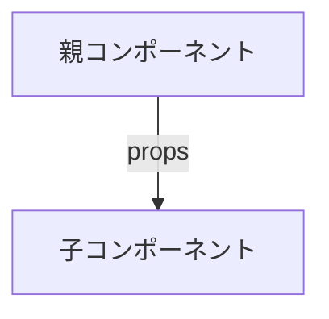
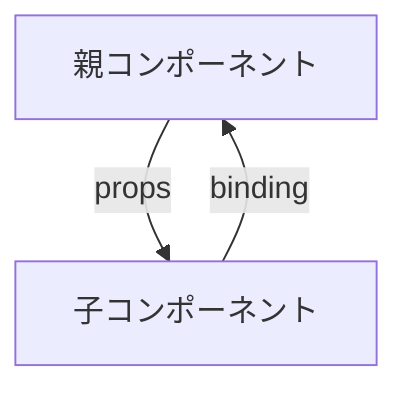

### 親コンポーネントから子コンポーネント

props



- 実装例

`Parent.svelte`
```
<script>
    import Child from './Child.svelte';
    let variable = 'こんにちは、子コンポーネント！';
</script>

<Child propName={variable} />
```

`Child.svelte`
```
<script>
    export let propName;
</script>

<p>{propName}</p>
```


### 子コンポーネントから親コンポーネント

双方向バインド




- 実装例

`Parent.svelte`

- `Parent.svelte`の`data`が更新されると`Child.svelte`の`value`に反映される。

- 双方向バインドによって、`Child.svelte`の`value`が更新されると、`parent.svelte`の`data`に反映される
```
<script>
 import Child from './Child.svelte';
 let data;
</script>
<Child bind:value={data} />
```

`Child.svelte`
```
<script>
 export let value;
</script>
```

### 
svelteではリアクティビィティはファイル内に限られる。
例えば、次のように`item.svelte`から`quantity`変数をimportした場合を考える。この場合、`item.svelte`内で変数の値を変更した場合、その変化はimport先では反映されない。
```
<script>
 import { quantity } from './item';
</script>
<p>Quantity: {quantity}</p>
```
### 参考
- Real World Svelte

- Svelteのstoreについて
https://www.docswell.com/s/northprint/K6Y4VL-2023-12-28-175020#p1


