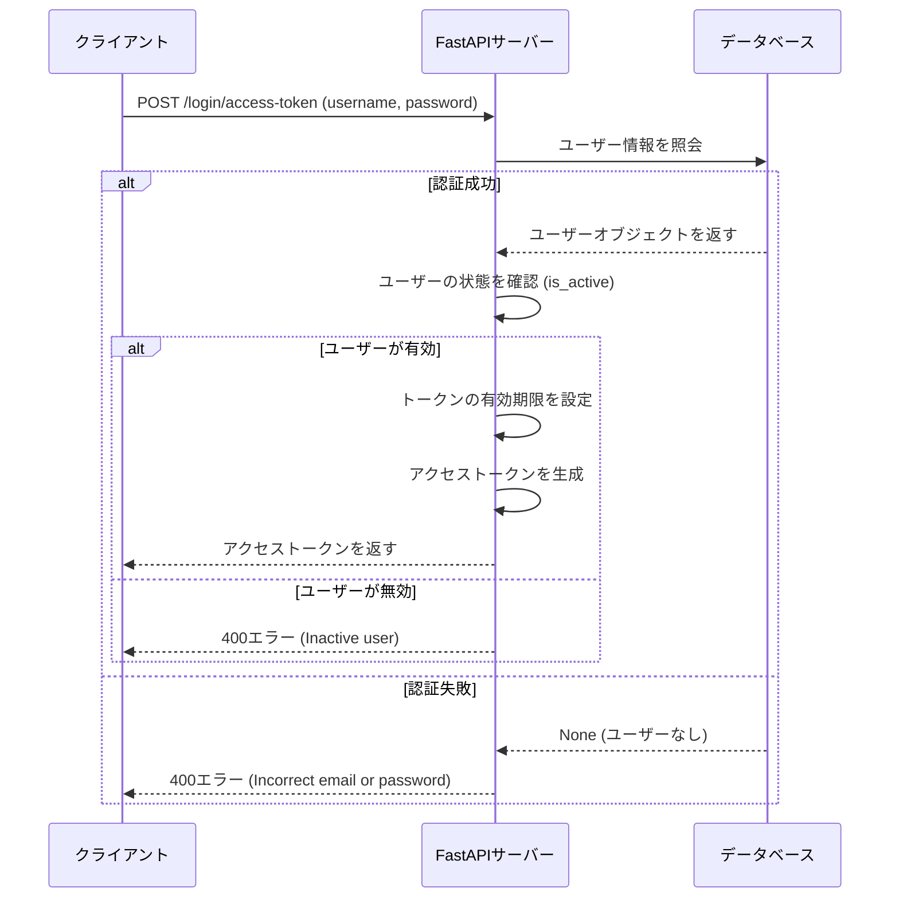

APIエンドポイント

/app/api/main.pyで次のように4つのサブルーターを統合している。
```
api_router = APIRouter()
api_router.include_router(login.router, tags=["login"])
api_router.include_router(users.router, prefix="/users", tags=["users"])
api_router.include_router(utils.router, prefix="/utils", tags=["utils"])
api_router.include_router(items.router, prefix="/items", tags=["items"])
```

`tags=["login"]`のように、タグ付けすることでSwaggerUI上でタグごとにパスが表示されるようになる。

`backend/routers`以下で各ルーターを定義。


`/signup`

- メールアドレス、パスワード、氏名で新規ユーザー登録をする。

`user_create = UserCreate.model_validate(user_in)`
として、`UserRegister`インスタンスから`UserCreate`インスタンスを作る
(`UserCreate`のみが持つ`is_active`属性と`is_superuser`属性はデフォルトでそれぞれ、`is_active=True`,`is_superuser=False`が割り当てられる。 )

### 設定情報
[Pydantic Settings](https://github.com/pydantic/pydantic-settings)を使用することでBaseSettingsを継承したクラスの中で環境変数を読み取って、型アノテーションを使用した検証、管理ができる。

環境変数はbackendディレクトリと同階層にある`.env`に記述して

`Basesettings`クラスを継承した`app/api/core.py`の`Settings`クラスで

```
    model_config = SettingsConfigDict(
        # Use top level .env file (one level above ./backend/)
        env_file="../.env",
        env_ignore_empty=True,
        extra="ignore",
    )
```
のように環境変数を読み取って、
設定情報を記述している

- 他のファイルでSettingsクラスで定義した設定用変数を使用する手順

    1. config.pyでsettings = Settings()としてインスタンスを生成
    2. 設定情報を使用するファイルの中で、from app.core.config import settingsとしてインポート
    3. 以下のように`settings.(変数名)`という形で記述する。

    ```
    user_in = UserCreate(
        email=settings.FIRST_SUPERUSER_EMAIL,
        password=settings.FIRST_SUPERUSER_PASSWORD,
        is_superuser=True,
        user_name=settings.FIRST_SUPERUSER_NAME,
    )
    ```

このようにすることで、Settingsクラスで定義した設定値に簡単にアクセスできる。

参考: 

- https://docs.pydantic.dev/latest/concepts/pydantic_settings/#usage


- [Pydantic Settingsのすゝめ](https://qiita.com/inetcpl/items/b4146b9e8e1adad239d8)
    - Pydantic settingsを使用するモチベーションや`SettingsConfigDict`の挙動についてわかりやすく書いてあります

https://zenn.dev/nowa0402/articles/47e3edb0e93380

### モデル定義

`app/models.py`に記述している。

例えば、ORMにSQLAlchemyを使う場合はSQLAlchemyモデルとPydanticモデルの2つを定義する必要がある。

しかし、SQLModelの場合は[公式ドキュメント](https://sqlmodel.tiangolo.com/?h=pydantic#editor-support-everywhere)
にあるように、SQLModelモデルはPydanticモデルとSQLAlchemyモデルを兼ねており、1箇所で定義すればよいので冗長性を減らすことができる。

```
class User(UserBase, table=True):
    id: uuid.UUID = Field(default_factory=uuid.uuid4, primary_key=True)
    hashed_password: str
    items: list["Item"] = Relationship(back_populates="owner", cascade_delete=True)
```
のように`table=true`とした場合にテーブル定義に使用される。

参考: https://sqlmodel.tiangolo.com/tutorial/create-db-and-table/

### 依存性注入
`app/api/deps.py`には依存性注入に使用する関数を置く


- OAuth2による認証

`OAuth2PasswordRequestForm`の実装
https://github.com/fastapi/fastapi/blob/master/fastapi/security/oauth2.py




参考
https://ritou.hatenablog.com/entry/20140927/1411811648
