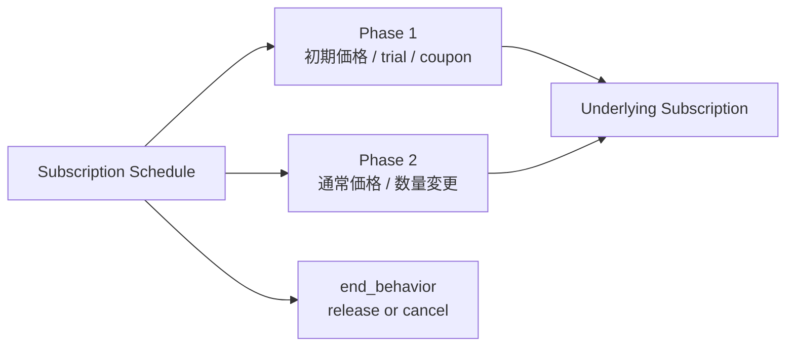

Stripe の Subscription Schedule は、サブスクリプションの将来変更を「今」決めておくための仕組みです。

単純なサブスクであれば `subscription` を直接更新すれば十分ですが、次のような要件が入ると Subscription Schedule が効いてきます。

- 来月1日から課金開始したい
- 今回の請求期間が終わったらダウングレードしたい
- 最初の3か月だけ割引し、その後は通常料金に戻したい
- 6回払いのように、有限回の定期請求を組みたい

この記事では、2026-03-06 時点の Stripe 公式ドキュメントと Changelog をベースに、Subscription Schedule を実務目線で整理します。

- まず何者なのか
- どんなユースケースで使うのか
- TypeScript でどう実装するのか
- 運用時にどこで事故りやすいのか

前提:

- API バージョンは `2026-01-28.clover`
- 2025-09-30.clover 以降は `iterations` ではなく `duration` を使う

公式ドキュメント:

- https://docs.stripe.com/billing/subscriptions/subscription-schedules/use-cases
- https://docs.stripe.com/api/subscription_schedules
- https://docs.stripe.com/api/invoices/create_preview
- https://docs.stripe.com/billing/subscriptions/webhooks
- https://docs.stripe.com/changelog/clover/2025-09-30/remove-iterations

## 先に結論

Subscription Schedule は、「Subscription の将来状態を phase 列として事前定義するオーケストレータ」と考えると理解しやすいです。

- `subscription`: いま課金中の実体
- `subscription_schedule`: その実体を、いつどう変えるかの計画
- `phases[]`: 各期間の価格、数量、trial、coupon、metadata など
- `end_behavior`: 最終 phase 終了後に `release` するか `cancel` するか

特に実務で重要なのは次の 4 点です。

1. 即時変更だけなら `subscription.update()` で済むことが多い
2. 将来変更を確定させたいときに Subscription Schedule を使う
3. 既存 subscription に対しては `from_subscription` で schedule を作る
4. schedule が付いた subscription を直接いじると、後で phase 遷移に上書きされることがある

## 1. Subscription Schedule とは何か

Stripe のドキュメントでは、Subscription Schedule は「subscription lifecycle を、期待される将来変更をあらかじめ定義して管理するもの」と説明されています。

設計上は、Subscription 本体の上にタイムラインを1枚かぶせるイメージです。



ここで重要なのは、schedule 自体が課金の実体ではないことです。  
実際に請求や請求書、支払い状態を持つのはあくまで `subscription` 側です。

Schedule は、その subscription に対して次を決めます。

- いつ開始するか
- どの phase をどれだけ続けるか
- phase ごとに何を変えるか
- 最後に subscription を残すか、止めるか

## 2. コア概念

### 2.1 phases

`phases` は時系列に並ぶ区間です。  
各 phase には価格、数量、trial、割引、metadata などを載せられます。

実務でまず押さえるべき点:

- phase は順番に実行される
- 同時に有効な phase は 1 つだけ
- current / future phase は最大 10 個まで
- phase 長は `duration` で持つのが基本

`duration` を使うと `start_date` / `end_date` のつなぎ込みを Stripe 側で処理してくれるため、手動で日付をつなぐより事故りにくいです。

### 2.2 end_behavior

最終 phase が終わったあとの扱いです。

- `release`: subscription は残す。schedule だけ外れる
- `cancel`: schedule と、その時点の active subscription も止める

実務では `release` をデフォルトに考えるほうが安全です。  
「将来変更の計画は終わるが、課金は続けたい」ケースが多いためです。

### 2.3 from_subscription

既存 subscription をベースに schedule を作るための入口です。

このパターンは「次回更新タイミングでダウングレード」「今の契約内容を phase 1 として固定し、その後の phase だけ変える」ときに便利です。

逆に、新規顧客へ future start のサブスクを作るなら、schedule を customer から直接作るほうが素直です。

### 2.4 proration_behavior

ここは少しややこしいです。Stripe には schedule まわりで proration の文脈が 2 つあります。

1. schedule 更新リクエスト自体の `proration_behavior`
2. phase 遷移時の `phases[n].proration_behavior`

考え方:

- 今すぐ current phase をいじるときの清算方針
- 将来、次の phase に入る瞬間の清算方針

代表的な値:

- `create_prorations`: 差額を proration として作る
- `always_invoice`: proration をすぐ請求まで進める
- `none`: proration を作らない

ダウングレード予約や請求境界での切り替えでは、`none` を選ぶと意図が明確になりやすいです。

### 2.5 invoice preview

Schedule は「将来どう請求されるか」が本質なので、作成前プレビューがかなり重要です。

Stripe は `invoices.create_preview` で次を確認できます。

- 次回 invoice 金額
- recurring 部分だけの表示
- schedule 作成前 / 更新前のシミュレーション
- tax や discount を含めた概算

実務では「作る前に preview、更新前にも preview」を基本フローにしたほうが安全です。

## 3. どんなユースケースで使うか

### 3.1 future start

最も分かりやすいのが future start です。

例:

- 来月1日から利用開始
- 契約日は今日だが、請求開始は来期初日
- セールスが合意した onboarding 日に合わせて契約を有効化

`subscription.create()` だけで無理に合わせるより、`start_date` を future にした schedule のほうが表現が自然です。

### 3.2 更新タイミングでのアップグレード / ダウングレード

B2B SaaS でよくあります。

- 今月末までは現プラン
- 次回請求日から新プラン
- 年額から月額へ、ただし今期分は使い切らせたい

この手の要件は「即時変更」ではなく「契約更新境界での変更」なので、schedule が向いています。

### 3.3 初期割引や trial の自動終了

マーケ施策でも使いやすいです。

- 最初の3か月は 50% off
- 初月無料、2か月目から通常価格
- 最初だけ seat 数を少なくし、後で標準構成に戻す

coupon や `trial_end` を phase に閉じ込めると、「いつ通常料金へ戻るか」が API 上で明確になります。

### 3.4 有限回の分割払い・期間限定契約

「毎月請求だが永続課金ではない」ケースです。

- 6回払い
- 12か月契約
- 一定期間だけの保守契約

最後を `cancel` にすれば、最終 phase 終了後に subscription ごと停止できます。

## 4. 逆に、使わないほうがよいケース

Subscription Schedule は便利ですが、すべてを schedule に寄せる必要はありません。

使わないほうがよい例:

- いまこの瞬間に 1 回だけ price を切り替えたい
- 将来 phase を持たない単純な quantity 変更
- 単なる `cancel_at_period_end` で足りる

この場合は通常の Subscription API のほうが単純です。

判断基準はシンプルで、将来の複数状態を事前定義したいかどうかです。

## 5. 実装例 1: future start の schedule を新規作成する

まずは一番単純な例です。  
「来月1日から 12 か月、月額プランを開始し、終わったら schedule だけ release する」実装です。

```ts
import Stripe from "stripe";

export const stripe = new Stripe(process.env.STRIPE_SECRET_KEY!, {
  apiVersion: "2026-01-28.clover",
});

type CreateFutureScheduleParams = {
  customerId: string;
  priceId: string;
  startAt: Date;
  months: number;
};

export async function createFutureSchedule({
  customerId,
  priceId,
  startAt,
  months,
}: CreateFutureScheduleParams) {
  return stripe.subscriptionSchedules.create({
    customer: customerId,
    start_date: Math.floor(startAt.getTime() / 1000),
    end_behavior: "release",
    phases: [
      {
        items: [{ price: priceId, quantity: 1 }],
        duration: {
          interval: "month",
          interval_count: months,
        },
        proration_behavior: "none",
      },
    ],
  });
}
```

ポイント:

- 新規なので `customer` から schedule を作る
- phase 長は `duration` を使う
- 2026-01-28.clover 前提なので `iterations` は使わない
- 将来開始のため、`start_date` は Unix timestamp を渡す

## 6. 実装例 2: 既存 subscription を次回更新でダウングレードする

実務で最も使うのはこの形だと思います。  
今の subscription を phase 1 として固定し、次の phase で price を落とします。

```ts
import Stripe from "stripe";

const stripe = new Stripe(process.env.STRIPE_SECRET_KEY!, {
  apiVersion: "2026-01-28.clover",
});

const toPhaseItems = (phase: Stripe.SubscriptionSchedule.Phase) =>
  phase.items.map((item) => ({
    price: typeof item.price === "string" ? item.price : item.price.id,
    quantity: item.quantity ?? 1,
  }));

export async function scheduleDowngradeAtRenewal({
  subscriptionId,
  nextPriceId,
}: {
  subscriptionId: string;
  nextPriceId: string;
}) {
  const schedule = await stripe.subscriptionSchedules.create({
    from_subscription: subscriptionId,
  });

  const currentPhase = schedule.phases[0];
  if (!currentPhase?.start_date || !currentPhase?.end_date) {
    throw new Error("Current phase is missing start_date or end_date");
  }

  return stripe.subscriptionSchedules.update(schedule.id, {
    end_behavior: "release",
    phases: [
      {
        items: toPhaseItems(currentPhase),
        start_date: currentPhase.start_date,
        end_date: currentPhase.end_date,
      },
      {
        items: [{ price: nextPriceId, quantity: 1 }],
        duration: {
          interval: "month",
          interval_count: 12,
        },
        proration_behavior: "none",
      },
    ],
  });
}
```

この例の意図は次のとおりです。

- いま進行中の請求期間はそのまま維持
- 期間終了までは現行プラン
- 次 phase から新 price に切り替え

ここで重要なのは、schedule 更新時は current / future phase を全部渡す必要があることです。  
「未来の phase だけ差し替える」つもりで一部だけ送ると、保持したい設定が落ちます。

## 7. 実装例 3: schedule 更新前に invoice preview を出す

UI から plan change を受けるなら、更新前に preview を返したほうが親切です。

```ts
import Stripe from "stripe";

const stripe = new Stripe(process.env.STRIPE_SECRET_KEY!, {
  apiVersion: "2026-01-28.clover",
});

const toPhaseItems = (phase: Stripe.SubscriptionSchedule.Phase) =>
  phase.items.map((item) => ({
    price: typeof item.price === "string" ? item.price : item.price.id,
    quantity: item.quantity ?? 1,
  }));

export async function previewDowngrade({
  scheduleId,
  currentPhase,
  nextPriceId,
}: {
  scheduleId: string;
  currentPhase: Stripe.SubscriptionSchedule.Phase;
  nextPriceId: string;
}) {
  if (!currentPhase.start_date || !currentPhase.end_date) {
    throw new Error("Current phase is missing start_date or end_date");
  }

  return stripe.invoices.createPreview({
    schedule: scheduleId,
    preview_mode: "recurring",
    schedule_details: {
      phases: [
        {
          items: toPhaseItems(currentPhase),
          start_date: currentPhase.start_date,
          end_date: currentPhase.end_date,
        },
        {
          items: [{ price: nextPriceId, quantity: 1 }],
          duration: {
            interval: "month",
            interval_count: 12,
          },
          proration_behavior: "none",
        },
      ],
    },
  });
}
```

`preview_mode: "recurring"` を使うと、one-off 項目を除いた recurring charge を見せやすくなります。  
プラン比較 UI や「次回から月額いくらになりますか？」に答える画面で便利です。

## 8. 実装例 4: Webhook でローカル状態を同期する

Schedule を導入したら、ローカル DB に `schedule_id` を持たせることが多いです。  
その場合は webhook で同期しておくと運用が安定します。

```ts
import Stripe from "stripe";

const stripe = new Stripe(process.env.STRIPE_SECRET_KEY!, {
  apiVersion: "2026-01-28.clover",
});

export async function handleStripeWebhook(rawBody: string, signature: string) {
  const event = stripe.webhooks.constructEvent(
    rawBody,
    signature,
    process.env.STRIPE_WEBHOOK_SECRET!,
  );

  switch (event.type) {
    case "subscription_schedule.created":
    case "subscription_schedule.updated":
    case "subscription_schedule.completed":
    case "subscription_schedule.released":
    case "subscription_schedule.canceled":
    case "subscription_schedule.aborted": {
      const schedule = event.data.object as Stripe.SubscriptionSchedule;

      // 例:
      // - 自前DBの schedule status を更新
      // - released/completed 後は schedule_id の関連を外す
      // - expiring 時に CS/営業へ通知する
      console.log(schedule.id, schedule.status, schedule.subscription);
      break;
    }
    default:
      break;
  }
}
```

最低限見ておきたいイベント:

- `subscription_schedule.created`
- `subscription_schedule.updated`
- `subscription_schedule.completed`
- `subscription_schedule.released`
- `subscription_schedule.canceled`
- `subscription_schedule.aborted`
- `subscription_schedule.expiring`

特に `released` は「subscription は残るが schedule は外れた」状態なので、アプリ側の状態管理でも区別しておくと混乱しにくいです。

## 9. 実務上の注意点

### 9.1 `release` と `cancel` を混同しない

これはかなり事故りやすいです。

- `release`: 計画だけ外す
- `cancel`: 計画と subscription を止める

「もう future phase は要らないが、今の subscription は続けたい」なら `release` です。

### 9.2 schedule が付いた subscription を直接更新しすぎない

Stripe のドキュメントでも、schedule が付いた subscription に直接変更を入れると、その変更が phase 分割や今後の phase 上書きにつながることがあると案内されています。

運用ルールとしては次が無難です。

- schedule がある subscription は、まず schedule API で触る
- ローカル DB に `subscription_id` と `schedule_id` を両方持つ
- `released` 後にだけ direct update へ戻す

### 9.3 現在 phase を更新するときは proration を明示する

デフォルトに任せると、「なぜこの差額 invoice が出たのか」が追いにくくなります。

特に次のケースでは明示したほうが安全です。

- 同請求期間中のアップグレード
- 月額 ↔ 年額切り替え
- seat 数変更
- 未払い invoice がある顧客への変更

### 9.4 `start_date=now` 直後の初回 invoice は即 finalize ではない

Stripe の Subscription Schedule 作成では、`collection_method=charge_automatically` で `start_date=now` の場合でも、最初の invoice は即 finalize されず、一度 `draft` として作られ、約 1 時間後に finalize されます。

これは通常の `subscription.create()` と体感が違うので、作成直後の UI や webhook 期待値を設計するときは注意が必要です。

### 9.5 billing cycle anchor を意識する

価格変更だけでなく「いつ請求を立てたいか」も設計対象です。

たとえば:

- 月初課金に寄せたい
- print から digital へ移る日に billing anchor も切り替えたい
- 契約移行日に合わせて更新日を揃えたい

このときは next phase で `billing_cycle_anchor` まで含めて設計したほうが、請求日ずれを防げます。

## 10. 設計指針

最後に、実務での判断基準を短くまとめます。

### Subscription Schedule を使う

- 将来変更を予約したい
- 複数 phase を持つ
- 割引終了や契約更新を自動化したい
- 限定回数の recurring billing を作りたい

### 通常の Subscription API で十分

- 即時の 1 回限りの変更
- 将来 phase を持たない
- `cancel_at_period_end` だけで足りる

## まとめ

Stripe の Subscription Schedule は、「複雑なサブスク」そのものを表す API というより、「将来変更を安全に予約するためのタイムライン API」と捉えると使いやすいです。

押さえるべき要点は次の 5 つです。

1. phase が本体で、将来変更を列として持つ
2. 既存 subscription には `from_subscription` が便利
3. 最終挙動は `end_behavior` で決まる
4. preview と webhook を前提に設計する
5. `iterations` ではなく `duration` を使う

実務では「次回更新での変更」「初期割引の自動終了」「future start」が特に相性のよいユースケースです。  
まずは `release` 前提の 2 phase 構成から始めると、設計も運用も比較的安定します。

## 参考

- Subscription schedules: https://docs.stripe.com/billing/subscriptions/subscription-schedules/use-cases
- Subscription Schedule API: https://docs.stripe.com/api/subscription_schedules
- Invoice preview: https://docs.stripe.com/api/invoices/create_preview
- Subscription webhooks: https://docs.stripe.com/billing/subscriptions/webhooks
- Changelog (`iterations` 廃止): https://docs.stripe.com/changelog/clover/2025-09-30/remove-iterations
