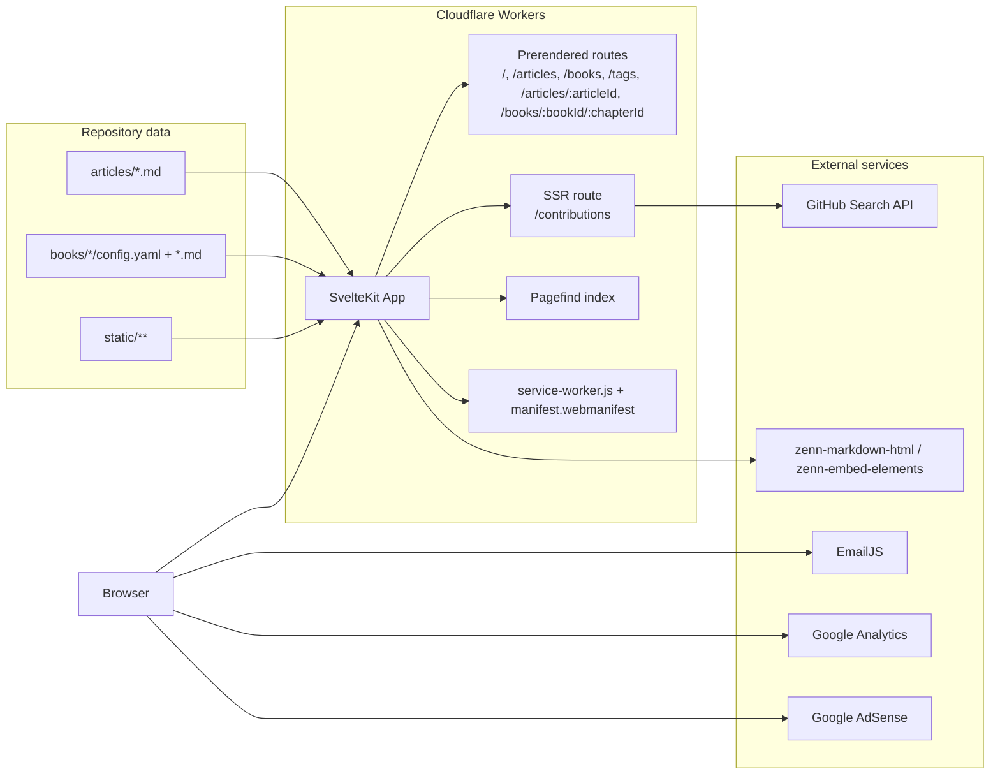

# yusuke-blog

SvelteKit 5 で構築した技術ブログです。`articles/` と `books/` の Markdown/YAML コンテンツをもとに、Cloudflare Workers 上で配信します。

## 技術スタック

| カテゴリ | 採用技術 |
| --- | --- |
| アプリ | Svelte 5, SvelteKit 2 |
| UI/スタイル | Tailwind CSS, bits-ui, melt-ui |
| コンテンツ | Markdown (`gray-matter`), YAML (`config.yaml`) |
| 検索 | Pagefind |
| デプロイ | Cloudflare Workers (`@sveltejs/adapter-cloudflare`, Wrangler) |
| テスト | Vitest, Playwright |

## ディレクトリ構成

```txt
.
├─ articles/                  # 記事Markdown
├─ books/                     # 本コンテンツ（book単位のフォルダ）
├─ docs/                      # ドキュメント（このREADMEを含む）
├─ scripts/                   # ビルド補助スクリプト
├─ src/
│  ├─ lib/
│  │  ├─ getArticles.ts       # 記事一覧の読み込み
│  │  ├─ getBooks.ts          # 本/章データの読み込み
│  │  ├─ contributions.remote.ts # GitHub PR一覧取得（Remote Function）
│  │  └─ server/
│  │     ├─ github.ts         # GitHub APIクライアント
│  │     └─ zennMarkdown.ts   # zenn-markdown-htmlラッパー
│  ├─ routes/                 # ルーティング
│  └─ service-worker.ts       # PWAキャッシュ制御
├─ static/                    # 画像・manifest・ads.txt など静的ファイル
└─ wrangler.jsonc             # Cloudflare Workers設定
```

## 現在の構成図（Mermaid）



## セットアップ

```bash
npm install
npm run dev
```

`pnpm` を使う場合:

```bash
pnpm install
pnpm dev
```

## 主要コマンド

```bash
npm run dev            # 開発サーバ
npm run check          # 型/静的チェック
npm run lint           # ESLint + Prettier check
npm run test           # Playwright + Vitest
npm run build          # build + postbuild（Pagefind/Sitemap生成含む）
npm run preview        # ローカルプレビュー
npm run generate:og    # OGP画像生成
```

## ビルド後処理

`npm run build` の後に `postbuild` で以下を実行します。

1. `pagefind --site .svelte-kit/cloudflare`
2. `node scripts/update-pagefind-manifest.js`
3. `svelte-sitemap --domain $PUBLIC_BASE_URL --out-dir ./.svelte-kit/cloudflare`

## コンテンツ管理

### 記事（`articles/*.md`）

記事は frontmatter を持つ Markdown として管理します。

| キー | 型 | 説明 |
| --- | --- | --- |
| `title` | `string` | 記事タイトル |
| `description` | `string` | 記事概要 |
| `date` | `string` (`YYYY-MM-DD`) | 公開日 |
| `topics` | `string[]` | タグ |
| `blog_published` | `boolean` | ブログで公開するか |
| `published` | `boolean` | 外部公開用フラグ（将来用途） |

### 本（`books/<slug>/`）

`config.yaml` と章Markdownを配置します。

| ファイル | 説明 |
| --- | --- |
| `books/<slug>/config.yaml` | 本のメタデータ（`title`, `summary`, `topics`, `published`, `price`, `chapters`） |
| `books/<slug>/*.md` | 各章。frontmatter で `title`, `free` を指定可能 |

章の表示順は次の優先順位で決まります。

1. `config.yaml` の `chapters` 配列順
2. `01.introduction.md` のような数値プレフィックス順
3. ファイル名順

## 環境変数

| 変数名 | 用途 | 必須 |
| --- | --- | --- |
| `PUBLIC_BASE_URL` | sitemap/canonical/OG URL の生成 | 推奨 |
| `PUBLIC_ADSENSE_CLIENT_ID` | 記事ページでの AdSense 読み込み (`ca-pub-...`) | 任意 |
| `GITHUB_TOKEN` | `/contributions` の GitHub API 認証（レート制限緩和） | 任意 |
| `VITE_YOUR_SERVICE_ID` | お問い合わせフォーム（EmailJS） | 任意 |
| `VITE_YOUR_TEMPLATE_ID` | お問い合わせフォーム（EmailJS） | 任意 |
| `VITE_YOUR_PUBLIC_KEY` | お問い合わせフォーム（EmailJS） | 任意 |

## デプロイ

Cloudflare Workers へデプロイします。

```bash
npm run build
npx wrangler deploy
```

`wrangler.jsonc` では `.svelte-kit/cloudflare/_worker.js` をエントリに設定しています。
